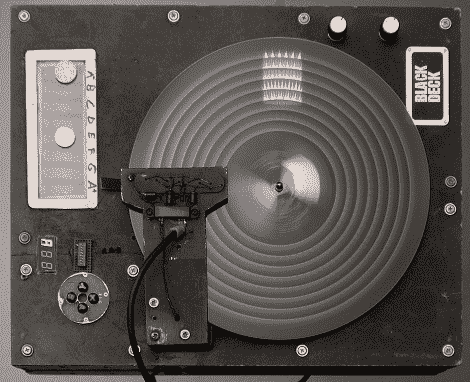

# 建造一个类似 Optigan 的仪器

> 原文：<https://hackaday.com/2011/09/13/building-an-optigan-like-instrument/>

[Olli]提交了他制作的名为 Black Deck 的乐器的文章。[Olli]的乐器受到[Jimi Tenor]的[光电话](http://www.jimitenor.com/gear.html)的启发——一个连接到风扇和光电池的透明圆盘。

一个透明的圆盘被放在转盘上[奥利]在一次翻垃圾箱的探险中获救。光线穿过光盘，被光电晶体管接收。在编写了一个在透明胶片上生成小比例尺的程序后，[奥利]将他的装置连接到立体声系统上，听着他的作品说话。为了控制唱片上的单个音轨(或音符)，[Olli]用光电开关制作了一个键盘，用来控制播放哪个音符。

从表面上看，[奥利]的仪器类似于一个光学仪器。虽然[Olli]的仪器能够产生波形，但 Optigan 能够再现采样的仪器。也就是说，我们认为[奥利]的黑色牌组在发电厂乐团和德沃的光学牌组旁边会感觉很舒服。休息之后，请查看 YouTube 上的 Black Deck 演示:

[https://www.youtube.com/embed/T7xk_pCOkC8?version=3&rel=1&showsearch=0&showinfo=1&iv_load_policy=1&fs=1&hl=en-US&autohide=2&wmode=transparent](https://www.youtube.com/embed/T7xk_pCOkC8?version=3&rel=1&showsearch=0&showinfo=1&iv_load_policy=1&fs=1&hl=en-US&autohide=2&wmode=transparent)