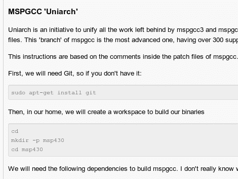

# 构建最新的 MSPGCC 工具链

> 原文：<https://hackaday.com/2011/06/27/building-an-up-to-date-mspgcc-toolchain/>

[Sergio Campamá]来信告诉我们，他已经为编写最新版本的 MSPGCC 收集了[指南。这是一个用于流行的 MSP430 系列微控制器的交叉编译工具链。在用](https://github.com/sergiocampama/Launchpad/blob/master/README.md) [TI Launchpad](http://hackaday.com/2010/08/11/how-to-launchpad-programming-with-linux/) 和 [eZ430-F2013](http://hackaday.com/2011/01/30/hands-on-with-ez430-f2013/) 开发时，我们使用了从 Ubuntu 仓库获得的版本。

从存储库安装很容易，但是您无法获得最新的特性，并且通常不支持较新的硬件。[Sergio]报道称，名为 Uniarch 的最新版本[将于本月中旬发布源代码和头文件，并支持 300 多种设备。事实上，它特别概述了使新硬件比以前的版本更容易集成的目标。他专门为 Ubuntu 定制了这个指南，但是当我们费力地通过谷歌搜索时，我们也发现了一个页面，概述了 OSX](http://permalink.gmane.org/gmane.comp.hardware.texas-instruments.msp430.gcc.user/9333) 的[编译。](https://sites.google.com/site/msp430ref/os-x/building-uniarch)

我们之前并没有注意到，但是 GitHub 确实让这些 README.md 文件在网页上看起来很漂亮，不是吗？