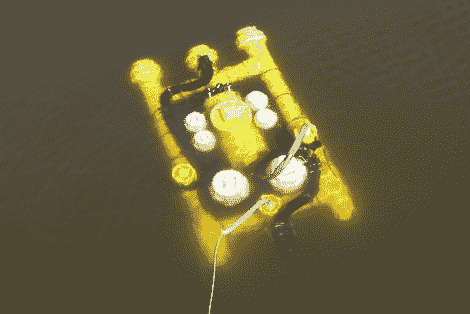

# 建造黄色潜水艇

> 原文：<https://hackaday.com/2010/02/23/building-the-yellow-submarine/>

潜艇建造总是很有趣，但是当涉及到保持水下时，经常会产生令人头痛的问题。[Jason Rollette] [建造这个 ROV 去探索密歇根湖的沉船。主要结构是聚氯乙烯和各种舱底泵用于推进。AVR ATmega32 通过以太网连接到地面来控制机载电子设备。他甚至有一个显示系统信息和视频源的 visual basic 程序。它可能没有我们看到的最后一艘潜艇](http://rollette.com/rovrev2/)[那么时尚，但是它的设计和建造令人惊讶。](http://hackaday.com/2009/12/28/star-trek-submarine/)

[谢谢 Daphreak]