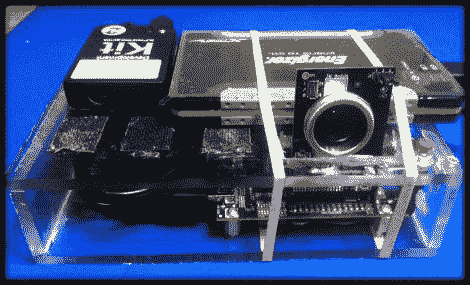

# 打造您自己的便携式 3D 相机

> 原文：<https://hackaday.com/2012/03/03/building-your-own-portable-3d-camera/>

[Steven]需要为他正在上的计算机视觉课程提出一个项目，所以他决定尝试制作一个便携式 3D 摄像机。他的目标是建立一个类似 Kinect 的 3D 扫描仪，尽管他的解决方案更适合非常详细的静态场景，而 Kinect 只能对动态场景进行浅层次、不太详细的扫描。

该设备使用 TI DLP 微型投影仪来显示结构光图案，而廉价的 VGA 相机则负责拍摄他正在捕捉的场景的快照。数据被输入一个 Beagleboard，OpenCV 被用来创建他正在扫描的物体的点云。然后，这些数据被传递到 Meshlab，在那里点云可以被组合和调整，以创建最终的 3D 图像。

正如[Steven]所指出的，考虑到他的设备是完全便携式的，并且只使用了一个带 VGA 摄像头的 HVGA 投影仪，因此最终的图像非常令人印象深刻。他说，使用更高分辨率设备的人肯定能够轻松地生成非常详细的 3D 图像。

请务必查看他的页面，了解该项目的更多细节，以及他用来将这些图像放在一起的代码的链接。