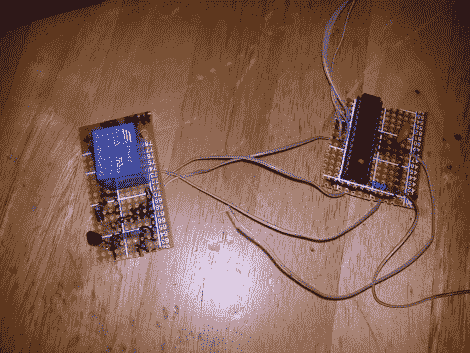

# 打造你自己的替代冰箱恒温器

> 原文：<https://hackaday.com/2011/10/13/building-your-own-replacement-refrigerator-thermostat/>

他每周去一次杂货店，回家后不久，他的冰箱就坏了，因为这是他三年来第二次坏冰箱，他想修好它，而不是再买一个新的。结果恒温器坏了，更换一个要花他 80 美元。这远远超过了他愿意支付的价格，但他的食品杂货开始变暖，所以他必须做点什么。

作为一名修理工，他认为他可以安装自己的恒温器，至少能和死在他身上的那个一样好。他从一个失败的项目中收集了一台 ATmega328，并在网上挖掘后，组装了他能找到的最基本的 Arduino 设置。微控制器隐藏在冰箱的后部，旧的恒温器曾经在那里，它从 TMP36 温度传感器接收输入，每当温度超过 4℃时，触发继电器启动冰箱的压缩机。

[Ron]说他的修理几乎是“有史以来最糟糕的组装”，但由于他节省了 80 美元的零件费用和 150 美元的人工费用，我们倾向于认为这是一项出色的工作。