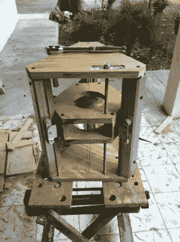

# 构建您自己的路由器提升机制

> 原文：<https://hackaday.com/2011/05/03/building-your-own-router-lift-out-mechanism/>

调整路由表中的位高可能是一件痛苦的事情。传统上，你需要进入桌面下的空腔进行调节，很难同时进行调节和测量高度。现代刳刨机现在提供了通过位于刳刨机工作台的板上的孔来调节高度的选项，但是这通常只在更昂贵的型号上发现。他没有购买新工具，而是建造了自己的路由器升降机。

他用回收的壁橱挂杆来让他的设备平稳运行。这些是让壁橱门挂在顶侧柱上的横杆和滑道。他在更换其中一个房间的壁橱门时保存了它们。有一个承载路由器的三角形门架，允许它在三组轨道上垂直移动。上图前景中的螺纹杆让木工通过旋转顶部的螺母来调整钻头高度。一旦安装在刳刨机工作台上，螺母就可以通过工作台面上的一个小孔接触到。