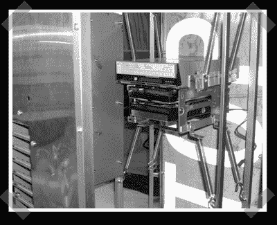

# 防弹 PC 外壳

> 原文：<https://hackaday.com/2007/04/28/bulletproof-pc-case/>

不是我们典型的票价，但我无法抗拒。[RCarter]正在从零开始构建一台具有单一独特功能的 PC——它被设计成[防弹](http://www.modders-inc.com/ftopic-1227-days0-orderasc-0.html)。显然，完成后他会把它带回去教训它一顿。现在他更关心硬件的防震。大多数人在个人电脑的使用寿命结束时会做这种事情。

*   [永久链接](http://www.modders-inc.com/ftopic-1227-days0-orderasc-0.html)