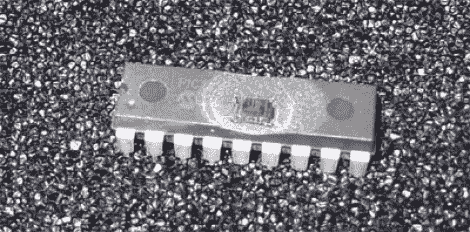

# [邦尼的]档案:解锁受保护的微控制器

> 原文：<https://hackaday.com/2011/06/27/bunnies-archives-unlocking-protected-microcontrollers/>

几年前[Bunnie]尝试破解 PIC 微控制器上的安全保险丝。像目前大多数常见的 8 位微控制器一样，他正在使用的 18F1320 有一套安全保险丝，可以防止内部闪存和 EEPROM 的回读。重置这些安全保险丝的唯一方法是擦除整个芯片，这也意味着你最初寻找的数据将被清除。也就是说，如果你仅限于使用正统的方法。

[Bunnie]有一套专业的芯片开盖，去除塑料外壳，而不损坏内部的硅芯片。他开始用电子显微镜检查里面的东西，并设法锤出了布局的基本图。原来闪存可以用紫外光擦除，就像老的 EPROM 芯片一样。微芯片想到了这一点，并在安全保险丝上放置了一些屏蔽，以防止它们以这种方式被重置。但[邦尼]还是设法做到了，创造了一个电子胶带掩模来保护芯片中存储的其余数据，同时以一定角度反射屏蔽下面的紫外光。

想要在不寻求他人帮助的情况下打开自己的一些芯片吗？[试试这个方法](http://hackaday.com/2010/07/16/decapping-integrated-circuits-with-sap/)。

[via [危险原型](http://dangerousprototypes.com/2011/06/27/hacking-the-pic-18f1320/)