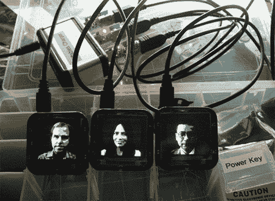
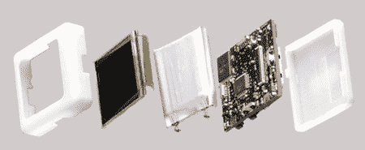

# 在筛床上燃烧

> 原文：<https://hackaday.com/2008/08/13/burning-in-the-siftables/>

【Curiouslee】贴了几张他在烧的 [Siftables 的照片。他把它们和所有的附件一起邮寄过来，并决定做一个特殊的盒子来装它们。他从一个 ArtBin 零件盒开始，在需要的地方裁出隔断，让所有东西都整齐美观。](http://www.flickr.com/photos/curiouslee/2747425303/in/pool-69453349@N00)

这些 [Siftables](http://web.media.mit.edu/%7Edmerrill/siftables.html) 相当有趣。它们是一种信息界面，应该更加物理和自然。他们用的比喻是，一个装有螺母和螺栓的容器可以用手很容易地筛选出来。他们设想我们能够类似地筛选数据。他们还提到它也可以用作手势界面。

每个单元都是一个带有屏幕、无线通信和红外传感器的小型设备。在他们的网站上有一些行动单位的照片和一个视频。

[通过[创建 Flickr 池](http://www.flickr.com/photos/curiouslee/2747425303/in/pool-69453349@N00)

*   [永久链接](http://web.media.mit.edu/~dmerrill/siftables.html)