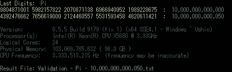

# 将圆周率计算到 10 万亿位；最后一个数字是 5

> 原文：<https://hackaday.com/2011/11/28/calculating-pi-to-10-trillion-digits-the-last-number-is-5/>

2010 年 8 月，[Alexander Yee]和[Shigeru Kondo]因计算圆周率的位数比任何人都多而赢得了相当多的赞誉。他们又回来了，这一次数字翻倍，达到 10 万亿。

之前的计算 5 万亿位数的圆周率需要 90 天才能在一台野兽般的工作站上完成。这些计算是在 2 个运行频率为 3.33 GHz 的至强处理器、96gb 的 RAM 和 32tb 的硬盘上进行的。10 万亿数字的尝试使用相同的硬件，但需要 48tb 的磁盘来存储一切。

不幸的是，计算 10 万亿位数所需的时间并不是线性增长的。[Alex]和[Shigeru]等了 371 天等待计算机完成计算。这些家伙使用了 [y-cruncher](http://www.numberworld.org/y-cruncher/) ，一个由【Alex】编写的多线程 pi 基准测试工具。y-cruncher 计算圆周率的十六进制数字；方便的是，[找到圆周率的第 n 个十六进制数字进行验证是相当容易的。](http://crd-legacy.lbl.gov/~dhbailey/dhbpapers/bbp-alg.pdf)

如果你想知道在 500 强超级计算机上计算圆周率是否会更快，你是对的。不过，这些盒子正忙着预测气候变化、核武器产量和治疗癌症。做一些别人从未做过的事情仍然是一个令人钦佩的目标，尤其是如果这意味着建造一台令人敬畏的计算机。