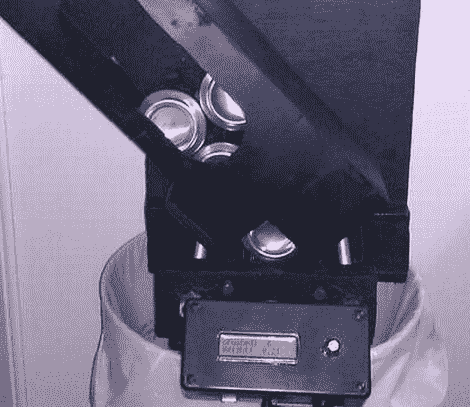

# Can Crusher 跟踪您的回收工作

> 原文：<https://hackaday.com/2011/04/25/can-crusher-keeps-track-of-your-recycling-efforts/>

Instructables 用户[MRHint]受到他朋友的回收努力的启发，决定也开始回收。他注意到的一件事是，他们通常不知道他们储存了多少罐头，也不知道他们的罐头袋有多重。他认为他可以在某种程度上自动化粉碎过程，同时使用一些电子设备和一些额外的工作来保持准确的罐数。

他首先设计了一个罐头压碎机，它将使用他放在家里的旧雨刷马达。马达连接到滑轮上，滑轮驱动一组连接到他的可移动破碎面板上的螺杆。当马达启动时，面板被拉向固定的板，压碎了罐子。[MRHint]也有一个未使用的 Arduino，所以他用它来控制破碎机，并记录破碎机已经运行了多少次。

从我们听到的情况来看，整个系统运行得很好，但是和其他项目一样，他认为还有很大的改进空间。未来的变化可能包括一个更强大的马达和一个链条/链轮装置来代替他目前使用的皮带和滑轮。对[MRHint]有什么其他建议吗？请在评论中告诉我们。