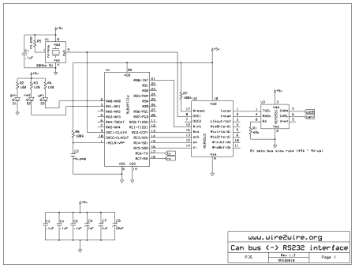

# CAN 嗅探方向盘按钮按压

> 原文：<https://hackaday.com/2011/03/08/can-sniffing-for-steering-wheel-button-presses/>

如果你有办法监控方向盘上的按钮，你可以让它们更有功能。甚至不要想打开工厂涂层来接触焊点，只需[接入 CAN 总线并监控数据流量](http://www.wire2wire.org/Can_sniffer/Can_sniffer.html)。

上面看到的小板子是一个项目的成果[彼得·沙比诺]称之为 CAN 嗅探器。左边的连接器将插入你车上的控制区域网络系统，让车上的芯片有事可做。有一个 MCP2551 CAN 收发器(隐藏在线性调节器下)和一个 SPI 控制的 MCP2515 CAN 控制器，负责处理 CAN 协议的细节。中间的大芯片是 PIC 16F876，负责处理数据。从那里一个 MAX232 芯片被用来提供一个串行接口连接设备到一台计算机。

这实际上并不局限于某个特定的功能。一旦你可以访问微控制器的总线，你将只受到固件编写技巧的限制。[Peter]已经发布了一个包含所有开源文件的档案，以及一步一步的电路板装配图。休息之后我们已经嵌入了档案中的原理图。

