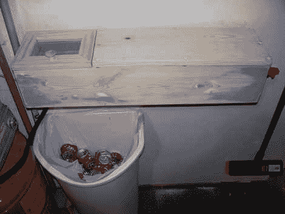

# 粉碎罐破碎机

> 原文：<https://hackaday.com/2010/02/18/cannihilator-can-crusher/>

这个盒子会将你的罐头压碎，并放入下面的垃圾桶里。被命名为 Cannihilator 的[Jeff Walsh]和他的两个儿子[Jake]和[Ryan]一起建造了这个。如果他们希望他们未来的项目成为常规的黑客功能，早期的黑客教育是很重要的。

破碎动力由螺线管气动活塞提供。正如在休息后的视频中看到的，罐头进入左边的门，被压碎，然后通过一个槽落下。[Jeff]在设计时考虑到了手指和手，并包括一些安全功能。“压碎”按钮位于罐槽的另一端，有一个切断开关来禁用螺线管，还有一个键控开关来关闭整个装置。基本的 Stamp 2 微控制器在子板的帮助下处理电子设备，以管理负载切换。这是对外面的[创意罐头粉碎机](http://hackaday.com/2007/10/15/electromagnetic-aluminum-can-crushing/)的一个很好的补充。

[https://www.youtube.com/embed/PcXpM-dxjLQ?version=3&rel=1&showsearch=0&showinfo=1&iv_load_policy=1&fs=1&hl=en-US&autohide=2&wmode=transparent](https://www.youtube.com/embed/PcXpM-dxjLQ?version=3&rel=1&showsearch=0&showinfo=1&iv_load_policy=1&fs=1&hl=en-US&autohide=2&wmode=transparent)

[谢谢迈克]