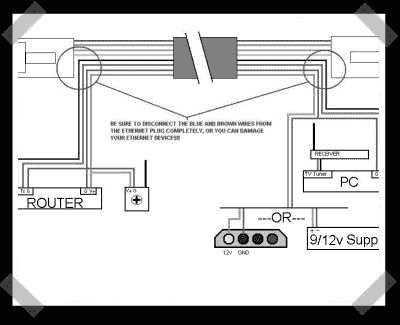

# Cat-5 以太网/串行/PoE 连接到您的无线路由器

> 原文：<https://hackaday.com/2008/03/26/cat-5-ethernetserialpoe-to-your-wireless-router/>

增加 [PoE](http://www.hackaday.com/2005/05/21/power-over-ethernet/) (以太网供电)只是[对【史蒂夫】来说还不够好](http://steveshacks.livejournal.com/2795.html)。他不仅在他的 Cat-5 上运行电源，他还共享地线，并使用剩余的一对线为他安装在屋顶的无线路由器添加串行控制台。很好。

*   [永久链接](http://steveshacks.livejournal.com/2795.html)