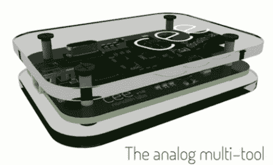

# CEE 是模拟电子的瑞士军刀

> 原文：<https://hackaday.com/2011/07/04/cee-is-a-swiss-army-knife-for-analog-electronics/>

nonolith 实验室的团队宣布了他们的 [CEE](http://www.nonolithlabs.com/blog/2011/announcing_cee_and_pixelpulse) ，这是一款被宣传为“模拟总线盗版”的设备，旨在控制、实验和探索模拟电子世界。Nonolith 实验室为 CEE 启动了一个 [kickstarter 活动](http://www.kickstarter.com/projects/itdaniher/cee-the-usb-analog-electronics-multi-tool)。

CEE 能够以 44.1k 样本/秒的速度进行亚毫伏和毫安采样，并通过少量焊接提供 2 个 5V @ 2A 通道。这允许通过基于网络的用户界面精确控制电机和传感器。我们认为这将是教授高中生电子艺术的一个很好的方式，并且与保罗·霍洛维茨的一些讲座结合起来会很好。

CEE 与 nonolith labs [Pixelpulse](http://www.nonolithlabs.com/pixelpulse/) 联系在一起，这是一个非常方便的模拟和数字信号可视化工具。你可以点击这里查看 Pixelpulse 模拟充电电容[的演示。](http://www.nonolithlabs.com/pixelpulse/demo.html)

我们希望这种对模拟电子教育的关注能够流行起来——你可以通过构建一个基于 [555 的迷你赛格威](http://hackaday.com/2011/01/27/555-based-balancing-bot/)学到比你在每个项目中拍打微控制器更多的东西。这和“任何白痴都能数到一”的理论是一样的。

在 kickstarter 活动页面上查看 CEE [的视频。](http://www.kickstarter.com/projects/itdaniher/cee-the-usb-analog-electronics-multi-tool)