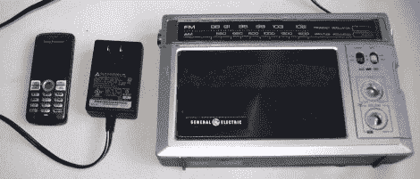

# 手机控制的复古收音机存储和播放你的数字图书馆

> 原文：<https://hackaday.com/2011/08/24/cellphone-controlled-retro-radio-stores-and-plays-your-digital-library/>

[Autuin]担心在和他的乐队旅行时，想要的电子产品会被偷。他不想带着笔记本电脑去巡演，但他也不想没有音乐。为了解决这个问题，他在一个看起来很便宜的收音机里内置了一个音乐播放器。他的文章涵盖了两种不同的便携式 MP3 解决方案，但引起我们注意的是第二种再现。

挖空旧收音机后，他用华硕 WL 硬盘 2.5 填补了空白。硬件是添加网络存储的一种简单方式；它包含一个笔记本电脑硬盘，并具有 WiFi 和以太网连接。但它也有一个 USB 端口，可以被黑客攻击添加第二个。[Autuin]就是这么做的，使用两个 USB 连接来添加蓝牙加密狗和 USB 声卡。音乐通过藏在古董盒电池盒中的 cat-5 电缆与硬盘同步。NAS 运行 Linux，音频播放软件通过一个运行在有点破的手机上的移动 Java 应用程序来控制。这个想法可能会融入我们的下一个项目。