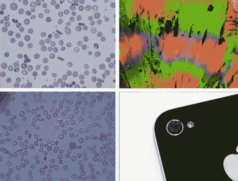

# 大约 20 美元的手机显微镜

> 原文：<https://hackaday.com/2011/10/19/cellphone-microscope-for-about-20/>

在没有医疗服务的地区，20 美元的医用显微镜摄影可能会改变游戏规则。这种特殊的黑客技术使用 iPhone 的 200 万像素摄像头和一个微小的玻璃球，将样本放大到实际大小的 350 倍。左边的两张图片是用简易显微镜拍摄的红细胞。这种放大方法的主要问题是聚焦平面非常薄，这是用软件处理所克服的。

这让我们想到了显微镜黑客，用激光穿过水滴，将图像投射到墙上。[的概念后来被改进为](http://hackaday.com/2011/03/02/a-different-take-on-a-laser-projection-microscope/)，用于载玻片上的样本。使用这种基于手机的方法有几个明显的优势。第一，可以看到样品的本来面目。第二，你不仅放大了样本，而且在一个连接到互联网的设备上已经有了数字化的图像。如果你想做一个医学诊断，这可以很容易地送到一个合格的专业人士进行分析。

发明这项技术的团队还发现了如何花几美元就能建造一台基于手机的光谱仪。右上角的图片就是那次黑客攻击的结果。两者都在顶部链接的页面上有一步一步的构建指南。显微镜只是一块橡胶中的玻璃珠，如图所示。分光计有点复杂。

[谢谢杨奇煜]