# CES:胆量胆量胆量

> 原文：<https://hackaday.com/2010/01/11/ces-guts-guts-guts/>

我们知道参加 CES，我们必须找到一些胆量的照片。不管是什么，如果有内脏露出来，我们就拍一张照片。我们有点失望，我们发现的内脏基本上是消费品，如相机、电视和大量放大器。放大器的内脏是如此丰富，我们实际上只是停止拍照。我们希望得到一些药片之类的东西。对你来说，这里可能没有什么新鲜的东西，但如果你和我们一样，你就会忍不住去看。休息后加入我们的画廊。

[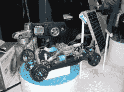](https://hackaday.com/2010/01/11/ces-guts-guts-guts/cimg0973/)[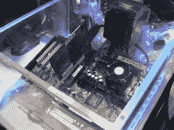](https://hackaday.com/2010/01/11/ces-guts-guts-guts/cimg0890/)[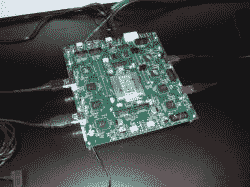](https://hackaday.com/2010/01/11/ces-guts-guts-guts/cimg0892/)[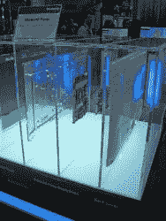](https://hackaday.com/2010/01/11/ces-guts-guts-guts/cimg0900/)[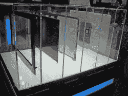](https://hackaday.com/2010/01/11/ces-guts-guts-guts/cimg0901/)[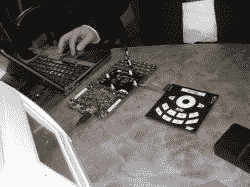](https://hackaday.com/2010/01/11/ces-guts-guts-guts/cimg0904/)[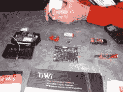](https://hackaday.com/2010/01/11/ces-guts-guts-guts/cimg0906/)[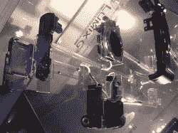](https://hackaday.com/2010/01/11/ces-guts-guts-guts/cimg0936/)[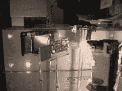](https://hackaday.com/2010/01/11/ces-guts-guts-guts/cimg0937/)[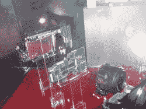](https://hackaday.com/2010/01/11/ces-guts-guts-guts/cimg0938/)[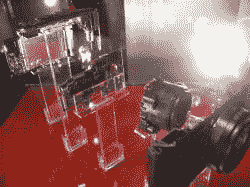](https://hackaday.com/2010/01/11/ces-guts-guts-guts/cimg0939/)[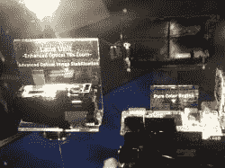](https://hackaday.com/2010/01/11/ces-guts-guts-guts/cimg0940/)[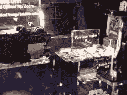](https://hackaday.com/2010/01/11/ces-guts-guts-guts/cimg0941/)[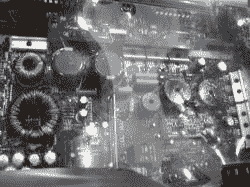](https://hackaday.com/2010/01/11/ces-guts-guts-guts/cimg0944/)[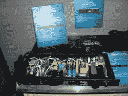](https://hackaday.com/2010/01/11/ces-guts-guts-guts/cimg0951/)[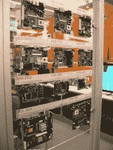](https://hackaday.com/2010/01/11/ces-guts-guts-guts/cimg0960/)[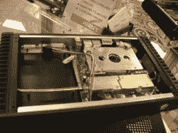](https://hackaday.com/2010/01/11/ces-guts-guts-guts/cimg0961/)[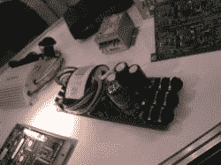](https://hackaday.com/2010/01/11/ces-guts-guts-guts/cimg0962/)[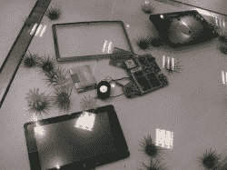](https://hackaday.com/2010/01/11/ces-guts-guts-guts/cimg0963/)[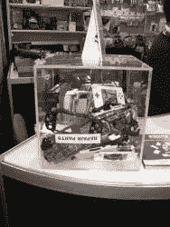](https://hackaday.com/2010/01/11/ces-guts-guts-guts/cimg0972/)[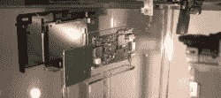](https://hackaday.com/2010/01/11/ces-guts-guts-guts/guts/)

更新了标题。没有太多的信息，大部分只是展示，没有人交谈。