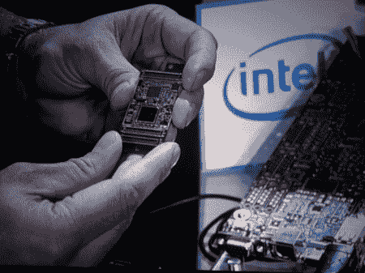
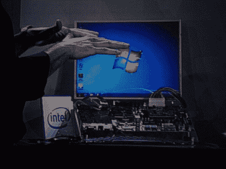
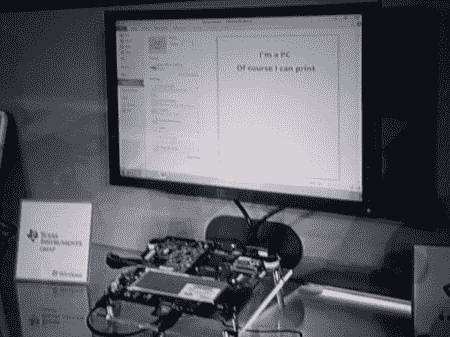
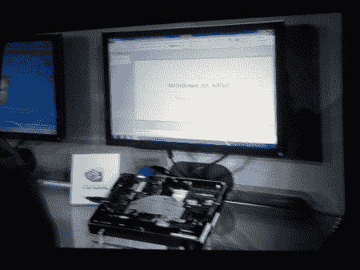

# CES:微软将下一代操作系统升级为 SOC

> 原文：<https://hackaday.com/2011/01/06/ces-microsoft-hacks-up-next-os-as-soc/>

随着【史蒂夫·鲍尔默】在[CES 展会前的主题演讲](http://www.engadget.com/2011/01/05/live-from-microsofts-ces-2011-keynote/)中宣布，他们的下一代操作系统将以特定于 SOC 的形式推出。这将使 windows 能够以比现在更有效的方式运行非常多样化的硬件。微软展示了来自 4 个不同制造商的 4 个不同版本的下一代原型，但还没有针对 SOC 的 GUI 工作，因为[鲍尔默]已经多次明确提到这一点。休息之后可以找到一些原型的照片！

下图是英特尔的片上系统迭代。

接下来的三张照片来自骁龙、德州仪器 OMAP 公司和英伟达的 Tegra 平台，它们都使用 ARM 处理器:

 

43.002684-81.21499