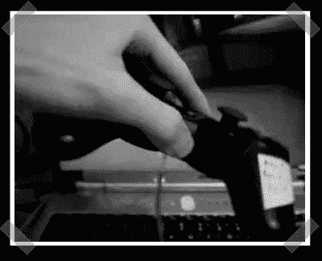

# 廉价的 360 度头部跟踪

> 原文：<https://hackaday.com/2008/02/09/cheap-360-degree-head-tracking/>

【乔尔】送来[他的](http://joelclemens.colinr.ca/stuff.html)努力打造一个廉价的 360 度头部追踪显示器。他用 Playstation 六轴控制器作为头盔追踪系统的钥匙。演示简短扼要。他正在使用常用的 [Glovepie](http://carl.kenner.googlepages.com/glovepie) 驱动程序来提供软件接口和头盔上看起来像现成的硬件。

真正吸引我注意的是现在进入 VR 的低成本。假设你有一台电脑，你可以用 Playstation 控制器和一个便宜的平视显示器的成本来建立自己的虚拟现实系统。(还记得[这些](http://www.hackaday.com/2007/10/07/25-head-mounted-display/)？)

*   [永久链接](http://joelclemens.colinr.ca/stuff.html)