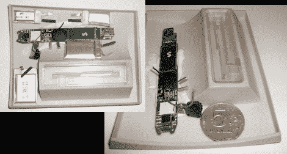

# 廉价的音频设备让 ATM 盗窃变得更容易

> 原文：<https://hackaday.com/2010/11/26/cheap-audio-equipment-makes-atm-theft-easier/>

ATM 信息被盗并不是什么新鲜事。使用撇油器来获取数据也不是。但是有点令人惊讶的是，使用音频设备组装设备变得如此容易。上面的图片是一个东欧废物出售的撇油器样品。这是攻击的磁条嗅探器部分，它将卡数据捕获为音频记录。后来被转换成从卡上读取的二进制代码。我们只是猜测，但这看起来很像笔式录音机的 PCB，你只需花几块钱就能买到。

当然，作为安全协议的第二部分，它与摄像头结合使用来捕获 PIN 数据，但它确实强调了对新 ATM 技术的需求。一些 skimmers [甚至不需要取回硬件](http://hackaday.com/2008/10/07/scammers-introduce-atm-skimmers-with-built-in-sms-notification/)，你永远不知道[下一个](http://hackaday.com/2009/08/04/malicious-atm-found-at-defcon-17/)粗略的机器可能会出现在哪里。

[通过 [Engadget](http://www.engadget.com/2010/11/24/criminals-constructing-atm-skimmers-from-daps/) 和 [Slashdot](http://yro.slashdot.org/story/10/11/23/1631210/Crooks-Hack-Music-Players-For-ATM-Skimmers)