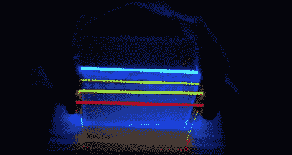

# 廉价黑客可能会加倍太阳能电池板的电力

> 原文：<https://hackaday.com/2008/07/10/cheap-hack-may-double-solar-panel-power/>

麻省理工学院的研究人员设计了一种他们称之为[太阳能聚光器](http://blog.wired.com/wiredscience/2008/07/see-through-sol.html)的东西，它将被放置在现有太阳能电池的顶部。它的目的是通过吸收可见光谱并将能量传递到专门的细胞来分离可见和红外光谱。他们声称，这将使太阳能电池板的效率提高一倍，并大大降低成本。

在过去的几年里，我们已经看到了许多有前途的太阳能电池板效率的进步，但这一次的特别之处在于惊人的简单和便宜的技术。基本上，这个团队所做的只是用简单的有机染料涂在一块玻璃上。在有机分子吸收可见光后，它们将能量传递到玻璃的侧面，在那里能量可以传递到它们特定的细胞。这个过程更有效，因为染料吸收光线，而不是像硅一样昂贵的东西。这意味着更少的硅，从而更好的价格范围。此外，这种材料只是一块玻璃的事实也开辟了太阳能窗户的可能性。

*   [永久链接](http://blog.wired.com/wiredscience/2008/07/see-through-sol.html)