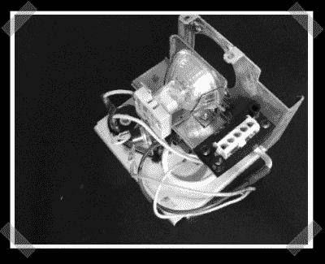

# 廉价的投影仪维修

> 原文：<https://hackaday.com/2008/05/22/cheap-projector-repair/>

【Ryan】发来了这篇关于 [DIY 投影仪维修的文章](https://web.archive.org/web/20080528105711/http://recklessphilosophers.com/2008/05/02/home-theatre-for-63--dlp-pj-retrofit-for-7-bulb-instead-of-300.aspx)。这篇文章有点难以理解，但也许它会激发一些未来的投影仪垃圾填埋节省。[异议者]用从更老的头顶投影仪上回收的 MR-16 硬件替换了旧的 DLP 投影仪中的灯泡和镇流器。所需的主要技巧是桥接触发引线，该引线告诉投影仪灯泡已打开并工作。

*   [永久链接](https://web.archive.org/web/20080528105711/http://recklessphilosophers.com/2008/05/02/home-theatre-for-63--dlp-pj-retrofit-for-7-bulb-instead-of-300.aspx)