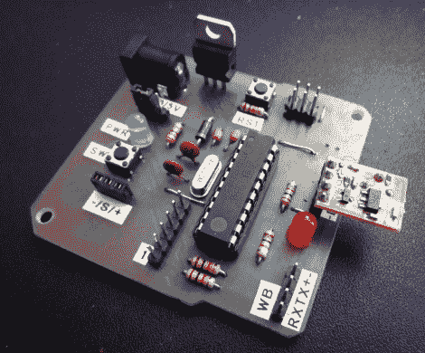

# 廉价的声控照明

> 原文：<https://hackaday.com/2011/07/15/cheap-voice-controlled-lighting/>

如果你有一点点时间和一些专业知识自己动手，语音控制的家庭自动化并不一定非常昂贵。[jjshortcut]想要在不使用物理开关的情况下控制他房间的照明。在他的博客上，他描述了他是如何不花一大笔钱就做到的。

他在易贝上买了一个 VRBot 语音识别模块，这是一个让你接触语音控制的简单方法。该设备有一系列内置的独立于扬声器的命令，以及记录多达 32 个自定义触发器的能力。他购买了一套简单的无线电灯开关，并开始进行黑客攻击，而不是搞乱电源电压和建造自己的电灯继电器。

他花了一些时间嗅探无线通信协议，找出灯是如何触发的，然后他使用 AVR 和廉价的 433 MHz 模块复制了这一功能。

尽管他能以如此低廉的成本组装起来，但该系统似乎运转良好。留下来看看他的语音识别系统运行的快速视频。

[https://www.youtube.com/embed/uKVuMxKY_bE?version=3&rel=1&showsearch=0&showinfo=1&iv_load_policy=1&fs=1&hl=en-US&autohide=2&wmode=transparent](https://www.youtube.com/embed/uKVuMxKY_bE?version=3&rel=1&showsearch=0&showinfo=1&iv_load_policy=1&fs=1&hl=en-US&autohide=2&wmode=transparent)