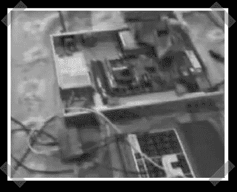

# Mediacenter 的 VPN 检查点

> 原文：<https://hackaday.com/2007/03/26/checkpoint-vpn-to-mediacenter/>

【莎莎】发来了这段[视频](http://www.youtube.com/watch?v=gUleb72-8Os)。将检查点防火墙转换成家庭媒体播放器需要相当长的时间(8 分钟)。视频中的那台只需要一个 PCI 视频卡、一个和一个 USB 集线器就可以变成一台普通的(仍然是 1U)机器。我不确定里面装的是什么 CPU，但足够运行 XP 了。

*   [永久链接](http://www.youtube.com/watch?v=gUleb72-8Os)