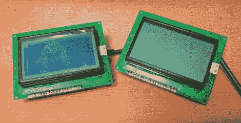

# chibi mo——基于 AVR 的 USB 显示器

> 原文：<https://hackaday.com/2011/07/08/chibimo-an-avr-based-usb-display/>

[Ko]想给他的电脑增加一台显示器，但他并不想要放在桌子上的大显示器，他想要更小、更小的显示器。

他的 ChibiMo 迷你 USB 显示器是一个整洁的小发明，可以让你将 Windows 桌面扩展或镜像到一个微小的 128×64 像素液晶面板上。乍一看，你可能会认为它太小了，没什么用，但在 Windows 中，它和任何标准显示器一样能被识别。这意味着，将系统监控软件单独加载到 LCD 面板上非常容易，让您的主显示器保持整洁。

该显示器像任何其他标准保护罩一样连接到 Arduino [上，并通过 USB 电缆连接到他的计算机上。一旦 ChibiMo 草图上传到 Arduino，就需要在 PC 上加载显示驱动程序。这允许你在 Windows 的显示管理器中调整 ChibiMo 的显示设置。](http://q61.org/en/chibimo/build/)

这是一个伟大的概念，我们希望看到进一步探索。截至目前，ChibiMo 只在 x86 版本的 Windows XP 上受支持，我们在他的网站上找不到任何源代码链接。也许我们社区中有一些有才华的成员会有兴趣尝试一下…