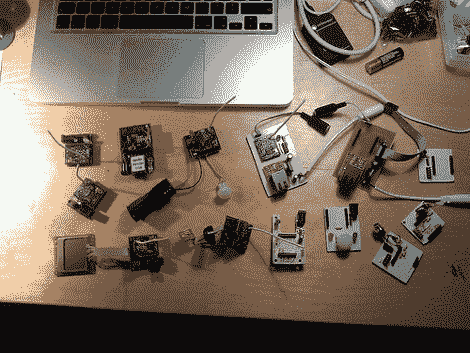

# Chipcon CC1110/CC1111 串行引导程序

> 原文：<https://hackaday.com/2012/03/09/chipcon-cc1110cc1111-serial-bootloader/>

[Joby Taffey]刚刚为 Chipcon CC1110/CC1111 处理器推出了一个串行引导加载程序[。该项目名为 CCTL，旨在让 Girltech IM-ME 的原型制作变得不那么乏味。到目前为止，设备的固件必须通过 GoodFET 或 TI 专有的编程器推入，速度非常慢。但是这个引导程序可以通过芯片的串行端口以 115200 波特的速度推送你的代码。但是](https://github.com/jobytaffey/cctl)[漂亮的粉红色传呼机](http://hackaday.com/2010/11/01/im-me-graphic-manipulation-using-sprites/)并不是唯一使用这些芯片的设备，为了证明这一点【乔比】发送了这张他手头上运行这种架构的所有电子设备的图片。

一旦 1KB CCTL 引导加载程序被刷新到芯片中，串行端口或 USB 到串行转换器可以用作编程器。[Joby]警告说，Chipcon 处理器不支持 5V，因此您需要使用 3V 串行转换器，或者在组合中添加电平转换器。

CCTL 提供了你期望从引导装载程序中得到的特性。它使用芯片的看门狗定时器来防止由于代码损坏而导致的故障。上电时有一种升级模式。使用说明包含在顶部链接的 Github repo 中。