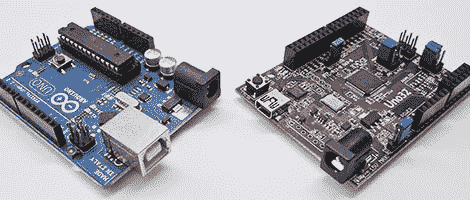
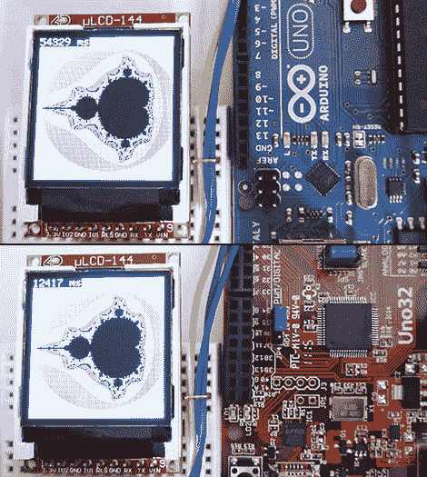
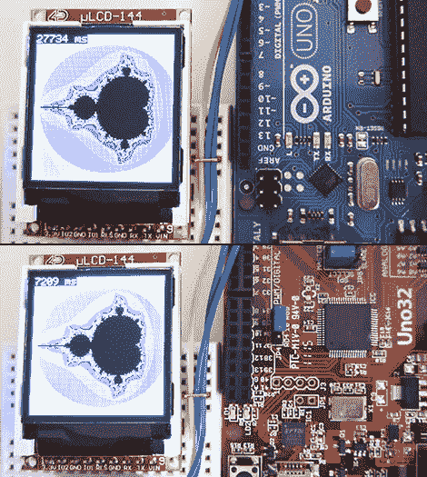

# 芯片套件 Uno32:第一印象和基准

> 原文：<https://hackaday.com/2011/05/27/chipkit-uno32-first-impressions-and-benchmarks/>



在 [Maker Faire](http://hackaday.com/2011/05/20/bay-area-maker-faire-hackaday-has-arrived/) 之后，我们花了几天时间四处逛逛 Digilent 的 32 位 [Arduino 兼容芯片套件板](http://hackaday.com/2011/05/12/chipkit-max32-an-arduino-mega-upgrade-with-a-pic32-under-the-hood/)和编译器。我们要报告一些初步的性能数据，以及对硬件和软件的印象。

声明:Digilent 提供了 Hack a Day 与 Uno32 和 Max32 板进行评估。

chipKIT 并不是将 Arduino 外形扩展到 32 位微控制器内核的第一次尝试……其他产品，如 [Maple](http://hackaday.com/2010/05/24/maple-r3-now-shipping/) 、 [Netduino](http://hackaday.com/2011/02/23/self-regulating-water-heater/) 或 FEZ Domino 已经存在一年多了……但 chipKIT 板值得注意的是 Digilent 为创建无缝过渡所做的努力。目标是为传统的 8 位 Arduino 板和 Digilent 的 32 位 work-alike 创建一个统一的工具，其中相同的 IDE、相同的代码和大量相同的 shields 都可以工作，尽管底层架构不同。事实上，他们希望 Arduino 项目接受他们的集成方法，将其作为向 Arduino IDE 添加新硬件的官方手段——不仅仅是为他们自己的产品，也为其他任何人使用。

正如我们在[之前的报告](http://hackaday.com/2011/05/21/bamf2011-chipkit-is-arduino-to-the-power-of-32/)中提到的，我们对他们似乎确实兑现了这一承诺印象深刻。“经典”Arduinos 和 32 位主板之间的过渡确实非常流畅。但我们发现，在这个早期阶段，仍有一些粗略的问题需要解决。因此，目前，我们将 Arduino IDE 和 Mpide (Digilent 的多平台衍生产品)都安装在开发系统上；后者尚未消除对前者的需求。但是我们看到了这个概念应该如何工作，我们喜欢它。

在很大程度上，Mpide 是一个双平台 ide。只需从 Tools->Board 菜单中选择合适的器件，重新编译，代码现在就可以用于相应的芯片了。但是有几件事困扰着我们:

*   Mpide 中的 [AVR 编译器](http://hackaday.com/2010/10/23/avr-programming-introduction/)要么没有完全优化，要么浮点库是在没有优化的情况下构建的。这导致了我们最初的基准数据——结果是糟糕的！为了保持数字的真实性，我们使用标准的 Arduino IDE 作为相应的基准。公平地说，他们确实在 Maker Faire 上亲自警告了我们这个性能问题，但是在这个问题得到解决之前，他们可以通过一些文档或在网站上更积极地解决这个问题…否则，看起来他们可能会试图歪曲基准，使之更有利于他们。
*   String()构造函数在处理整数时被中断。下面的代码行对于 AVR 芯片来说编译得很好，但是对于 PIC32 编译器来说就不合适了:

    ```
    String foo = String(42);
    ```

鉴于 IDE 在上线和 Maker Faire 上发布前几个小时就已经包装好了，所以有一些零散的细节是可以理解的。作为早期采用者，请做好准备，这不会像他们希望的那样顺利。[开源](http://hackaday.com/?s=open+source)的伟大之处在于，我们可以进入那里，发现这样的问题，并提供建议和提交修复方案……随着时间的推移，情况无疑会有所改善。

### 一些基准

我们想创造一个类似于他们在 Maker Faire 上展示的分形演示。我们手头没有漂亮的 [SparkFun 彩色液晶显示屏](http://www.sparkfun.com/products/9363)，所以我们不得不满足于一个串行液晶显示屏， [4D 系统公司的 uLCD-144](http://www.4dsystems.com.au/prod.php?id=121) 。正如我们将看到的，这确实对数字有所影响。

单就 MIPS 而言，chipKIT 应该比 Arduino 快 5 倍。然后是它的原生 32 位:当处理较大的数字时，Arduino 核心的 AVR 处理器必须在连续的 8 位值之间移动和调整位，以实现 32 位的结果。因此 PIC32 应该显示出比 MIPS 更大的性能优势。实际上，这并不总是成功的。

uLCD-144 是一款 128 x 128 像素的 16 位彩色 [LCD](http://hackaday.com/2011/03/17/bill-hammack-explains-how-led-backlit-lcd-monitors-work/) ，带有一个串行 UART 接口，运行速度为每秒 115，200 位。图形命令的效率不是很高，而且需要为绘制的每个像素发送一个 5 字节的数据包。这包括坐标数据；串行模式下没有块写入功能。另一方面，使用 Arduino 或 chipKIT 的原生串行 UART 很容易交谈。

下面是 Mandelbrot 草图的代码，使用浮点数学:

```

/* Simple Mandelbrot set renderer for Arduino vs. chipKIT benchmarking
   w/floating-point math, via www.hackaday.com.  This example uses the
   4D Systems uLCD-144(SGC) serial display module, wired as follows:

      uLCD Pin:   RES  GND  RX  TX  VIN
   Arduino Pin:     2  GND   1   0   5V    */

const int
  pixelWidth  = 128,  // LCD dimensions
  pixelHeight = 128,
  iterations  = 255;  // Fractal iteration limit or 'dwell'
const float
  centerReal  = -0.6, // Image center point in complex plane
  centerImag  =  0.0,
  rangeReal   =  3.0, // Image coverage in complex plane
  rangeImag   =  3.0,
  startReal   = centerReal - rangeReal * 0.5,
  startImag   = centerImag + rangeImag * 0.5,
  incReal     = rangeReal / (float)pixelWidth,
  incImag     = rangeImag / (float)pixelHeight;

void setup()
{
  pinMode(13,OUTPUT);   // Arduino status LED
  pinMode(2,OUTPUT);    // LCD reset pin
  digitalWrite(13,LOW); // LED off
  Serial.begin(115200);

  digitalWrite(2,LOW);  // Reset LCD
  delay(10);
  digitalWrite(2,HIGH);
  delay(2000);          // Allow time for reset to complete

  Serial.write(0x55);   // Issue auto-baud command
  while(Serial.read() != 0x06); // Wait for ACK
}

void loop()
{
  unsigned char cmd[20];   // Serial packet for LCD commands
  int           x,y,n;
  float         a,b,a2,b2,posReal,posImag;
  long          startTime,elapsedTime;

  Serial.write(0x45);      // Clear screen
  delay(100);              // Brief pause, else 1st few pixels are lost

  cmd[0] = 0x50;           // 'Pixel' command is issued repeatedly

  digitalWrite(13,HIGH);   // LED on while rendering
  startTime = millis();

  posImag = startImag;
  for(y = 0; y &lt; pixelHeight; y++) {
    cmd[2] = y;            // Y coordinate of pixel
    posReal = startReal;
    for(x = 0; x &lt; pixelWidth; x++) {
      a = posReal;
      b = posImag;
      for(n = iterations; n &gt; 0 ; n--) {
        a2 = a * a;
        b2 = b * b;
        if((a2 + b2) &gt;= 4.0) break;
        b  = posImag + a * b * 2.0;
        a  = posReal + a2 - b2;
      }
      cmd[1] = x;          // X coordinate of pixel
      cmd[3] = n * 29;     // Pixel color MSB
      cmd[4] = n * 67;     // Pixel color LSB
      Serial.write(cmd,5); // Issue LCD command
      posReal += incReal;
    }
    posImag -= incImag;
  }

  elapsedTime = millis() - startTime;
  digitalWrite(13,LOW);    // LED off when done

  // Set text to opaque mode
  cmd[0] = 0x4f;
  cmd[1] = 0x01;
  Serial.write(cmd,2);

  // Seems the chipKIT libs don't yet handle the String(long)
  // constructor, hence this kludge.  Working backward, convert
  // each digit of elapsed time to a char, with &quot; ms&quot; at end
  // and text command at head.  Length is variable, so issue
  // command from final determined head position.
  cmd[19] = 0;
  cmd[18] = 's';
  cmd[17] = 'm';
  cmd[16] = ' ';
  n = 15;
  do {
    cmd[n--] = '0' + elapsedTime % 10;
    elapsedTime /= 10;
  } while(elapsedTime);
  cmd[n--] = 0xff; // Color LSB
  cmd[n--] = 0xff; // Color MSB
  cmd[n--] = 0;    // Use 5x7 font
  cmd[n--] = 0;    // Row
  cmd[n--] = 0;    // Column
  cmd[n] = 0x73;   // ASCII text command
  Serial.write(&amp;cmd[n],20-n);

  delay(5000); // Stall a few seconds, then repeat
}

```

Arduino(顶部)和 chipKIT(底部)的计时结果以毫秒为单位:



arduino:54329 毫秒

重申一下(原谅双关语)，由于一些性能问题，我们使用传统的 Arduino 编译器，而不是 Mpide 中包含的那个。如果你很好奇，编译器的输出花了大约 *8.5 分钟*来完成任务！哦。

因此，大约 4.4 倍的加速。还不错，但我们期待更大的不同。部分原因是由于与 LCD 串行通信的固有瓶颈…我们稍后将回到这个问题。另一个限制因素是两种芯片都在模拟浮点数学。如果我们可以使用 32 位整数数据类型，PIC32 应该会大放异彩。于是，一个[定点](http://answers.hackaday.com/converting-floating-point-maths-to-int-maths/) Mandelbrot 生成器随之而来:

```

/* Simple Mandelbrot set renderer for Arduino vs. chipKIT benchmarking
   w/fixed-point math, via www.hackaday.com.  This example uses the
   4D Systems uLCD-144(SGC) serial display module, wired as follows:

      uLCD Pin:   RES  GND  RX  TX  VIN
   Arduino Pin:     2  GND   1   0   5V    */

const int
  bits        = 12,   // Fractional resolution
  pixelWidth  = 128,  // LCD dimensions
  pixelHeight = 128,
  iterations  = 255;  // Fractal iteration limit or 'dwell'
const float
  centerReal  = -0.6, // Image center point in complex plane
  centerImag  =  0.0,
  rangeReal   =  3.0, // Image coverage in complex plane
  rangeImag   =  3.0;
const long
  startReal   = (long)((centerReal - rangeReal * 0.5)   * (float)(1 &lt;&lt; bits)),
  startImag   = (long)((centerImag + rangeImag * 0.5)   * (float)(1 &lt;&lt; bits)),
  incReal     = (long)((rangeReal / (float)pixelWidth)  * (float)(1 &lt;&lt; bits)),
  incImag     = (long)((rangeImag / (float)pixelHeight) * (float)(1 &lt;&lt; bits));

void setup()
{
  pinMode(13,OUTPUT);   // Arduino status LED
  pinMode(2,OUTPUT);    // LCD reset pin
  digitalWrite(13,LOW); // LED off
  Serial.begin(115200);

  digitalWrite(2,LOW);  // Reset LCD
  delay(10);
  digitalWrite(2,HIGH);
  delay(2000);          // Allow time for reset to complete

  Serial.write(0x55);   // Issue auto-baud command
  while(Serial.read() != 0x06); // Wait for ACK
}

void loop()
{
  unsigned char cmd[20];   // Serial packet for LCD commands
  int           x,y,n;
  long          a,b,a2,b2,posReal,posImag,startTime,elapsedTime;

  Serial.write(0x45);      // Clear screen
  delay(100);              // Brief pause, else 1st few pixels are lost

  cmd[0] = 0x50;           // 'Pixel' command is issued repeatedly

  digitalWrite(13,HIGH);   // LED on while rendering
  startTime = millis();

  posImag = startImag;
  for(y = 0; y &lt; pixelHeight; y++) {
    cmd[2] = y;            // Y coordinate of pixel
    posReal = startReal;
    for(x = 0; x &lt; pixelWidth; x++) {
      a = posReal;
      b = posImag;
      for(n = iterations; n &gt; 0 ; n--) {
        a2 = (a * a) &gt;&gt; bits;
        b2 = (b * b) &gt;&gt; bits;
        if((a2 + b2) &gt;= (4 &lt;&lt; bits)) break;
        b  = posImag + ((a * b) &gt;&gt; (bits - 1));
        a  = posReal + a2 - b2;
      }
      cmd[1] = x;          // X coordinate of pixel
      cmd[3] = n * 29;     // Pixel color MSB
      cmd[4] = n * 67;     // Pixel color LSB
      Serial.write(cmd,5); // Issue LCD command
      posReal += incReal;
    }
    posImag -= incImag;
  }

  elapsedTime = millis() - startTime;
  digitalWrite(13,LOW);    // LED off when done

  // Set text to opaque mode
  cmd[0] = 0x4f;
  cmd[1] = 0x01;
  Serial.write(cmd,2);

  // Seems the chipKIT libs don't yet handle the String(long)
  // constructor, hence this kludge.  Working backward, convert
  // each digit of elapsed time to a char, with &quot; ms&quot; at end
  // and text command at head.  Length is variable, so issue
  // command from final determined head position.
  cmd[19] = 0;
  cmd[18] = 's';
  cmd[17] = 'm';
  cmd[16] = ' ';
  n = 15;
  do {
    cmd[n--] = '0' + elapsedTime % 10;
    elapsedTime /= 10;
  } while(elapsedTime);
  cmd[n--] = 0xff; // Color LSB
  cmd[n--] = 0xff; // Color MSB
  cmd[n--] = 0;    // Use 5x7 font
  cmd[n--] = 0;    // Row
  cmd[n--] = 0;    // Column
  cmd[n] = 0x73;   // ASCII text command
  Serial.write(&amp;cmd[n],20-n);

  delay(5000); // Stall a few seconds, then repeat
}

```

数字是:



arduino:27734 毫秒

现在只有 3.8 倍的差异，尽管 PIC32 说的是母语。怎么回事？

即使在 115，200 位/秒的速度下，串行 LCD 也严重阻碍了我们的发展，因为输出每个字符时代码都会“阻塞”。一些粗略的计算显示了在这方面浪费了多少时间:

128 x 128 像素，每像素 5 字节命令= 81，920 字节。
包括每个字节的开始和停止位= 819，200 位总计
819，200 位/ 115，200 bps = ~7.1 秒。

因此，我们的 MCU 会在那里停留 7 秒钟，竖起大拇指查看 ASCII 码，以便更新显示。果不其然，如果我们注释掉 Serial.write()命令，但保留所有的计算，结果会明显更有戏剧性:

浮点型:

arduino:49685 毫秒
chip kit:5822 毫秒
9.3 倍提升。

定点:

arduino:22326 毫秒
chipKIT: 168 毫秒
133 倍提升。热*该死。*这才是我们要说的！

因此，我们实际上可以以交互式帧速率来渲染，因为需要足够快的 LCD 接口。每当我们连接到现实世界的设备时，这种限制就会突然出现。不是所有的东西都是 100%的内部代码和数学…I/O 吞吐量是有限的，这比任何东西都更能限制整个应用程序的速度。因此，我们真的无法对这款主板给出一致的“一切都会快 X %”的估计。

对于数学来说，性能看起来不错，特别是如果算法可以以整数或定点格式工作。我们的另一个想法是[模数](http://hackaday.com/2011/02/20/analog-to-digital-converter-build/)采样，它在机器人学中有应用……比如说一个[直线跟随器](http://hackaday.com/2010/09/17/line-following-tank-without-a-microcontroller/)或[平衡](http://hackaday.com/2009/02/19/segway-and-input-filtering/)机器人。更频繁的采样应该产生更平滑的操作，或者可以对多个采样求平均值以产生更高精度的结果。在这方面，PIC32 应该*尖叫*。然而……

```

void setup()
{
  const int samples = 10000;
  int       i,n;
  long      startTime,elapsedTime;

  Serial.begin(115200);

  startTime = millis();
  for(i = 0; i &lt; samples; i++) {
    n = analogRead(0);
  }
  elapsedTime = millis() - startTime;

  Serial.print(samples);
  Serial.print(&quot; samples in &quot;);
  Serial.print(elapsedTime);
  Serial.print(&quot; ms = &quot;);
  Serial.print(((float)samples * 1000.0) / (float)elapsedTime);
  Serial.println(&quot; samples/sec&quot;);
}

void loop()
{
}

```

arduino:1119 毫秒内 10000 个样本= 8936.55 个样本/秒
芯片套件:1008 毫秒内 10000 个样本= 9920.63 个样本/秒

在全速运行时，PIC32 每秒能够处理高达 100 万个 ADC 样本，而 Atmel 芯片每秒可处理 125，000 个样本。当然，库的实现会引入一些开销，但是会带来什么呢？在库源代码中翻来翻去，在 wiring_analog.c:

```

 //*     A delay is needed for the the ADC start up time
 //*     this value started out at 1 millisecond, I dont know how long it needs to be
 //*     99 uSecs will give us the same approximate sampling rate as the AVR chip
 //      delay(1);
 delayMicroseconds(99);

```

这引发了一些危险信号。首先，为什么采样速率要以匹配 AVR 为目标？对于与时间相关的函数，比如 delay()和 Serial.begin()比特率，我们当然希望得到类似的数字，即与时间增量相关的数字。但是我们不——或者至少不应该——用 ADC 读数来测量时间。其次，为什么不找出 ADC 的实际启动时间呢？经过几分钟对微芯片数据表的筛选，最终找到了正确的答案:*两微秒。*因此，将 wiring_analog.c 中的行改为:

```
delayMicroseconds(2);
```

产生截然不同的结果:

芯片套件:10000 个样本在 101 毫秒内= 99009.90 个样本/秒

大约十倍的改善，读数仍然有效。这确实破坏了基于 AVR 的 Arduinos 的定时兼容性，但正如我们所说，为什么呢？可以理解的是，有些决定可能是匆忙做出的…这是一个巨大的项目，将所有这些代码移植到一个完全不同的芯片上，IDE 仍然刚刚出炉…但这些小细节确实让我们担心下面可能还隐藏着其他惊喜。

不要误解我们…我们对 chipKIT 板充满热情。技术挑战已经解决，只需要一些清理工作。Digilent 现在面临的是一个营销挑战:*这到底是给谁的？*当我们谈论诸如大样本和定点算法之类的东西时，这些并不是 Arduino 的首次程序员目标受众所熟悉的第一天话题。更高级的用户可能已经离开了，把 Arduino 留在了后面。那么，为什么要保留这种外形呢？为什么要保留这个 IDE？

显然，诱惑的一部分是 Arduino [shields](http://hackaday.com/2011/05/11/arduino-magnetic-core-memory-shield/) 的现有生态系统。有一些非常漂亮的东西，网络、触摸屏和步进电机驱动器，其中大部分都可以直接插入。拥有一个现有的解决方案可以节省开发时间。然后是 Arduino 库的易用性和熟悉性。尽管它们在某些地方很慢很笨重[，但有时只需向串行端口输出一些状态信息，而不必手动完成所有的 UART 设置，这真的很方便。](http://hackaday.com/2010/01/06/arduino-io-speed-breakdown/)

chipKIT 板的价格很聪明，在成本基础上接近 Arduino(甚至比 Arduino 低一点)。这是一个很好的开始，代码和价格都一样，但是额外的价值在哪里呢？Uno32 和 Max32 可能需要的是一些杀手级应用。新手可以实现的想法，但真正利用 PIC32 芯片的附加性能和能力。速度可能只是其中的一部分。对于普通 Arduino 无法处理的额外 RAM 和闪存空间，我们能做些什么呢，即使是使用最先进的盾牌也不行。人们已经用[小型 8 位 AVR](http://hackaday.com/2010/05/01/phasor-av-pal-demo-uses-atmega88/) 做了一些令人兴奋的事情。我们期待着看到这是否是将这些黑客带到下一个层次的工具。