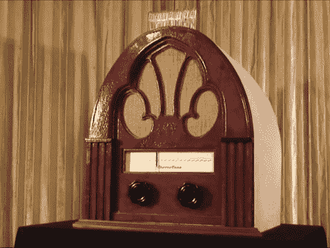

# ChronoTune:按年份听广播，而不是按频率

> 原文：<https://hackaday.com/2011/04/29/chonotune-listen-to-radio-by-year-not-by-frequency/>

ChronoTune 是一台播放不同时代声音的收音机。这个项目是由汽车城的黑客空间[i3 底特律](http://www.i3detroit.com/)的一些成员作为红牛创造挑战赛的参赛作品开发的。它允许用户转动转盘来收听历史上的新时刻，但他们也可以收听当天的节目。迎接他们的将是调谐收音机的声音，随后是表盘上显示的那个时期常见的音乐或音频剪辑。

正如你从上一届参赛作品中了解到的那样，每个项目都必须使用 Arduino 才能获得参赛资格。它读取附在箱子前面的一个旋钮上的旋转编码器。这个不直接动调音针。相反，它被附在喷墨打印机的内脏上来来回回地移动它。如果需要的话，这可以让收音机自动调谐。

音频从几个来源播放。有一个 MP3 模块允许较长的剪辑，但也有一些 ISD 录音机芯片模块播放较短的剪辑。如果将刻度盘调到当前日期，调频收音机模块将通过无线电收听电台。

看不清那个表盘吗？别担心，有一个模拟数码管显示器伸出外壳顶部，提供当前选择的时间段的数字读数。休息之后，请观看视频，了解团队如何带领我们完成 ChronoTune 的每个部分。

[谢谢邓肯]