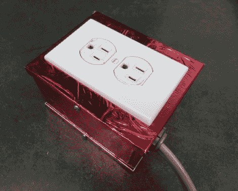

# 圣诞树水传感器得到升级和一个别致的新盒子

> 原文：<https://hackaday.com/2011/12/07/christmas-tree-water-sensor-gets-an-upgrade-and-a-fancy-new-box/>

[Eric Ayars]在家里有一个漂亮的铸铁圣诞树支架，但唯一的缺点是这个支架很难看到圣诞树上有多少水。[去年我们报道了他发明的一个小工具](http://hackaday.com/2010/12/08/christmas-tree-low-water-monitor/)来帮助记录水位，但是正如你们几个人预测的那样，[这个系统最终失败了。](http://hacks.ayars.org/2010/12/christmas-tree-water-level-sensor.html)

他以前的解决方案使用镀铜的原型板来感应支架中有多少水，但导线在大约一周的时间内就腐蚀了。圣诞节即将来临，他决定再试一次。

他改进的水位传感器依赖于测量水下铜条板的电容变化，而不是像以前的模型那样检测完整的电路。为了保护他的传感器，这一次他在电路板上涂上了聚氨酯，这应该可以提供一个像样的腐蚀屏障。

使用 Arduino CapSense 库，传感器可以检测到水的存在，如果底座需要重新填充，就会发出警报。我们的一位读者建议他使用树本身作为低水指示器，这正是[Eric]今年所做的。如果水位稍低，Arduino 控制的为采油树供电的继电器会每隔 5 秒关闭一次，然后再次打开。如果底部快干了，这棵树就用莫尔斯电码反复闪烁“水”这个词来请求浇水。

我们认为今年的解决方案相当聪明，我们很高兴看到[Eric]在去年的挫折后没有放弃！