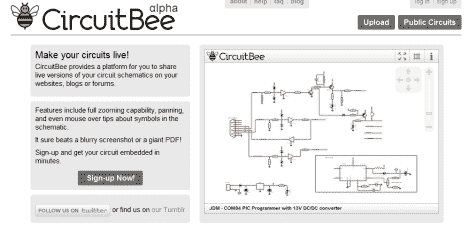

# CircuitBee 使共享原理图和电路图变得容易

> 原文：<https://hackaday.com/2011/07/27/circuitbee-makes-sharing-schematics-and-circuit-diagrams-easy/>

当寻找可写的东西时，没有什么比可以下载的文档丰富的图表和代码更让我们喜欢的了。就原理图而言，我们意识到发布它们可能会有点麻烦。很多时候，我们看到的是模糊的 JPEGs 格式或庞大的 PDF 文件，这两种格式都不太方便使用。CircuitBee 的人也有同样的想法，他们一直在努力让每个人更容易与世界分享他们的好想法。

他们的免费服务只需要注册，不需要别的。一旦你进入，你可以自由上传你的 Eagle 或 KiCAD 电路图，然后通过 CircuitBee 的服务器运行。它们将您的绘图转换为可嵌入的对象，这样其他人就可以轻松地查看您的项目。他们的嵌入式原理图窗口可以以全屏模式呈现，并使用户能够放大绘图的任何部分，以查看电路的细节。

CircuitBee 的[Ben Delarre]表示，该产品目前处于 alpha 阶段，因此在不久的将来会有大量的功能和有用的工具。如果你喜欢构建和共享，这绝对是值得一试的东西！

[通过[使](http://blog.makezine.com/archive/2011/07/circuitbee-sharing-electronic-schematics-on-your-blog.html)

[谢谢，桑丘]