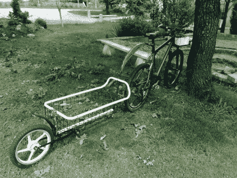

# [Clement]看到货运自行车，举起一辆自行车货运拖车

> 原文：<https://hackaday.com/2011/10/02/clement-sees-the-cargo-bike-and-raises-a-bicycle-cargo-trailer/>

[Clement]和他的朋友要进行一次长途自行车旅行，他们需要一种随身携带工具的方法。他们开始工作，并设法用大部分重复利用的材料建造了这辆货运拖车。

这个拖车唯一被重复使用的部分是连接装置，可以让你把它挂在任何自行车上。这是作为一个可拆卸的管夹制造的(大概是在一个机械车间)，可以很快地在不同的自行车之间进行切换。它焊接了一个万向节，这样座位杆的角度就不会影响拖车的行驶。

鹅颈保持拖车足够远，以避免妨碍后轮。网篮是由一台旧工业机器的零件制成的。后轮连接着一个摇臂，摇臂上有一个看起来像橡胶缓冲器的东西，作为减震器。但是，如果你想确保一个大的颠簸不会让你的行李飞起来，[Clement]在他的帖子底部附上了一张照片，显示了一个更好的弹簧冲击在一个不同的自行车拖车上。

如果你对这篇文章的标题感到困惑，那你一定错过了最近推出的货运自行车。