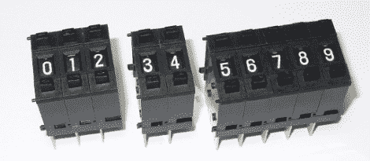

# 用推轮开关点击和计数

> 原文：<https://hackaday.com/2011/08/16/clicking-and-counting-with-push-wheel-switches/>

推轮开关是比较古老的技术，但是小鸟电子博客的[约翰·鲍克夏尔]向我们展示了它们今天仍然非常有用。

在一个快速但彻底的演示中，他讨论了这种输入技术是如何工作的，展示了一位数和多位数输入。前者非常简单，计数器的每个输出都与 Arduino 上的一个 I/O 引脚相连。使用多个计数器单元会稍微复杂一些，但使用恩智浦 74HC4066 双向开关会使这项工作变得更容易。他分享了一段 Arduino 代码，这段代码切换每一个开关，一个接一个地读取它们的值。

对于那些刚刚接触 Arduinos 和各种输入法的人来说，他的演示是必不可少的。这些计数器非常适合 1-4 位数的输入需求，但是如果你需要更多位数，[John]说 12 位数的键盘可能是更好的选择。

留下来看一个简短的视频演示，看看这些开关是如何工作的。

[https://www.youtube.com/embed/UMJ_HtExnzU?version=3&rel=1&showsearch=0&showinfo=1&iv_load_policy=1&fs=1&hl=en-US&autohide=2&wmode=transparent](https://www.youtube.com/embed/UMJ_HtExnzU?version=3&rel=1&showsearch=0&showinfo=1&iv_load_policy=1&fs=1&hl=en-US&autohide=2&wmode=transparent)