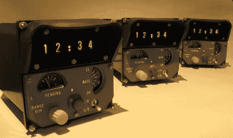

# 用旧飞机剩余零件制造的时钟

> 原文：<https://hackaday.com/2011/07/25/clocks-built-from-old-aircraft-surplus-parts/>

几年前，Tube Clock 论坛成员[Sine1040]购买了一套四个全新的飞机指示器单元，它们建于 70 年代初的某个时候。他不知道这些单元实际上是用来做什么的，但他知道他可以将它们重新利用[成一些看起来非常光滑的时钟](http://www.tubeclockdb.com/forum/Builders-Forum/2326-Rank-precision-indicator-unit-clock.html)。

他拆开了所有四个盒子，从中搜罗了足够的零件来制作三个钟。在取出时钟并重新排列数字后，他使用 ATMega8 构建了一个计时电路，该电路由 DS32 振荡器计时。

当时间使用大型投影式数字显示器显示时，秒在最左侧的模拟仪表中显示。分钟也显示在时钟最右侧的模拟窗口中，每经过一分钟，指针就会上下摆动。

[Sine1040]特别注意保持箱子看起来尽可能的库存，唯一的外部修改是安装一个电源插头代替旧的接地螺钉。这个钟绝对是保持时间的一种不同方式，我们认为它看起来很棒。

继续阅读，观看时钟运行的快速演示视频。

[谢谢布莱恩]

[https://www.youtube.com/embed/mMbgb7q2Syw?version=3&rel=1&showsearch=0&showinfo=1&iv_load_policy=1&fs=1&hl=en-US&autohide=2&wmode=transparent](https://www.youtube.com/embed/mMbgb7q2Syw?version=3&rel=1&showsearch=0&showinfo=1&iv_load_policy=1&fs=1&hl=en-US&autohide=2&wmode=transparent)