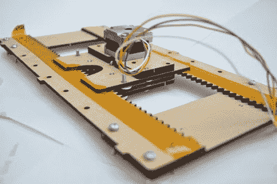

# 硬质纤维板数控开沟棒

> 原文：<https://hackaday.com/2010/07/16/cnc-build-ditches-rods-for-hardboard/>

这是为[彼得·詹森的]选择性激光烧结设备重新设计的 x 轴。我们上个月参观了[的 SLS 项目](http://hackaday.com/2010/06/25/selective-laser-sintering-rig-on-the-cheap/)，从那以后他一直在完善设计。新组件使用齿条和齿轮系统，依靠一些 Kapton 胶带来减少摩擦，以实现平滑的滑动。一个步进电机为激光切割齿轮箱提供动力，四个齿轮将滑板连接到框架上，以实现稳定准确的运动。现在他只需要计算出找到最佳齿轮比的数学/物理学，因为这个原型只是一个粗略的猜测。如果你有解决这个问题的技巧，请帮[Peter]一把，因为我们对这个问题的进展非常兴奋。