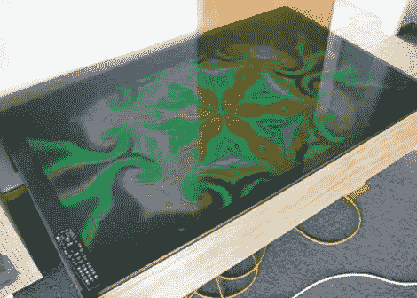

# 咖啡桌在烟熏玻璃后面上演一出好戏

> 原文：<https://hackaday.com/2012/02/03/coffee-table-puts-on-a-show-behind-smoked-glass/>

这张咖啡桌是一件真正的展品。它有一个冒烟的[玻璃表面，将 LCD 屏幕隐藏在](http://www.youtube.com/watch?v=WhsNt4Sp97s)内。但是如果它只能播放视频，那会有什么乐趣呢？外壳的其余部分容纳了将这个客厅核心变成计算机所需的所有部件。

休息之后，你可以看到一段展示构建过程每一步的视频。首先，去掉屏风的外壳，用剩下的部分来决定桌子的木框尺寸。显示屏固定到位后，[Nate]开始工作，为主板和其他部件安装和开发冷却解决方案。他做得很好，最后得到了一张桌子，我们会很自豪地把它放在家里。

现在他有了强大的计算能力和巨大的显示屏，但还缺少什么吗？你认为在这上面加上触摸感应输入会有多难？我们想知道用于制作 Android 触摸屏的覆盖层是否可以安装在玻璃的下面？

构建日志照片:

[https://www.youtube.com/embed/bH4QiAsTPCw?version=3&rel=1&showsearch=0&showinfo=1&iv_load_policy=1&fs=1&hl=en-US&autohide=2&wmode=transparent](https://www.youtube.com/embed/bH4QiAsTPCw?version=3&rel=1&showsearch=0&showinfo=1&iv_load_policy=1&fs=1&hl=en-US&autohide=2&wmode=transparent)

简短演示:

[https://www.youtube.com/embed/WhsNt4Sp97s?version=3&rel=1&showsearch=0&showinfo=1&iv_load_policy=1&fs=1&hl=en-US&autohide=2&wmode=transparent](https://www.youtube.com/embed/WhsNt4Sp97s?version=3&rel=1&showsearch=0&showinfo=1&iv_load_policy=1&fs=1&hl=en-US&autohide=2&wmode=transparent)

[谢谢马修]