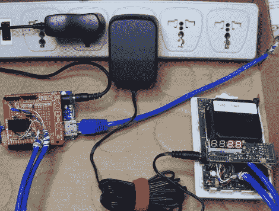

# 以科学和安全的名义收集氡数据

> 原文：<https://hackaday.com/2012/03/27/collecting-radon-data-in-the-name-of-science-and-safety/>

当克里斯·纳菲斯(Chris Nafis)在他的历史悠久的住宅上扩建时，他发现氡的问题，之前用大量的混凝土缓解了，但似乎又再次出现了。他最终决定安装一个氡风扇和探测器——后者无法存储测量数据。他想更好地感受他房子里的短期和长期氡测量，希望找到温度、湿度和地面释放的氡总量之间的一些关联。

为了做到这一点，他拆卸了位于家中不同地方的一对氡探测器，并将每个探测器连接到一个 Arduino 上。他使用示波器来确定哪个 PCB 引线控制显示器上的不同 led 段，很快就让 Arduinos 从传感器中收集测量数据。[Chris]认为跟踪数据的最佳方式是在线进行，所以他将微控制器与 Pachube 连接起来，这样他就可以轻松地分析他的历史读数。

他为自己设定的另一个目标是，只有当水平开始上升时才启动氡风扇，以节省一点电费。随着他的数据记录操作全面展开，我们认为这应该是一个容易完成的任务。