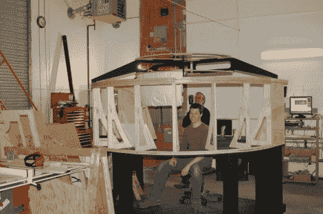

# 环绕在主驾驶舱周围的平行显示器

> 原文：<https://hackaday.com/2012/02/17/collimated-displays-wrap-around-that-home-cockpit/>

我们不记得以前听过“准直显示”这个术语，但我们看到过它们的实际应用。这些是镜面投影显示器，由于精心设计的光学元件，给观众带来真正的外围视觉体验。这是一个[Rob]和[Wayne]投入大量时间的项目。这是他们自己版本的[DIY 准直显示器，使用商店 vac 和 Arduino 形成屏幕形状](http://www.mycockpit.org/forums/showthread.php/22211-Collimated-display-build-thread)。

上面的框架是支撑屏幕的结构。后来，一张聚酯薄膜贴在了那个框架的边缘。它被真空的吸力吸引到位。但是它需要被拉伸到合适的程度，否则投影的图像会失真。他们有某种 PID 控制器来管理这个。建造了一个阀箱来改变筛框内的真空吸力。当屏幕到达适当的位置时，位于聚酯薄膜片后面的开关向 Arduino 提供反馈，伺服系统关闭吸气箱。如果你在那里的某个地方失去了我们，跳跃后剪辑中的描述将有助于澄清事情。

这是[一个不相关的项目](http://www.diy-cockpits.org/coll/collimated_display.html)，它在较小的规模上实现了相同的概念。

[https://www.youtube.com/embed/QC7H61palXs?version=3&rel=1&showsearch=0&showinfo=1&iv_load_policy=1&fs=1&hl=en-US&autohide=2&wmode=transparent](https://www.youtube.com/embed/QC7H61palXs?version=3&rel=1&showsearch=0&showinfo=1&iv_load_policy=1&fs=1&hl=en-US&autohide=2&wmode=transparent)

[谢谢基思]