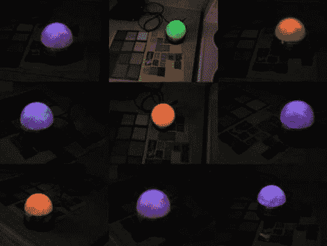

# 利用 RGB LED 和光敏电阻进行颜色检测

> 原文：<https://hackaday.com/2011/12/08/color-sensing-with-an-rgb-led-and-photoresistor/>

[Fjord Carver]将[一个 RGB LED 和 CdS 光敏电阻组合在一起，制成一个颜色传感器](http://www.instructables.com/id/Using-an-RGB-LED-to-Detect-Colours)。这些硫化镉光传感器在暴露于不同程度的光敏感度时，通常具有非常大的电阻波动。当使用微控制器的 ADC 读取时，这有助于提高分辨率。LED 通过将已知波长的光照射到被测表面上来发挥作用。对每种不同颜色的 LED 分别读取三个读数，然后用于推断测试材料的 RGB 值。我们看到[几年前使用了完全相同的方法](http://hackaday.com/2009/05/20/color-detection-using-an-rgb-led/)。这次是 Arduino 在测量，而不是 PIC。

那么为什么这个传感器没有出现在这张图片中呢？这是因为我们欣赏[Fjord]用于这种传感器的应用。他制作了一盏灯，发出与放置它的表面相同的颜色。