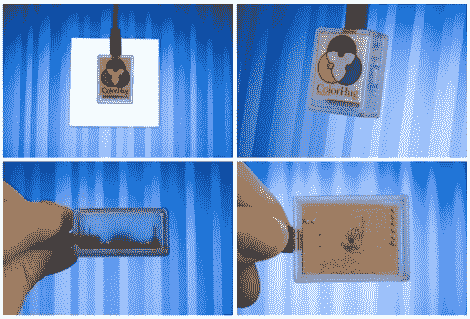

# ColorHug:一个价格合理、完全开放的颜色校准工具

> 原文：<https://hackaday.com/2011/11/15/colorhug-a-reasonably-priced-completely-open-color-calibration-tool/>

[Richard]想要为他的计算机显示器创建一个颜色配置文件，但是他对他找到的现有销售的颜色校准产品并不满意。色彩校准工具可能有些昂贵，但更令[Richard]不安的是，它们都是封闭源代码的。封闭的硬件和封闭的软件可能是一种拖累，尤其是当制造商不再支持一种产品时，因此他开始设计自己的开源显示器校准工具。

一旦他的 ColorHug 传感器靠着显示器放置，它就开始从屏幕上采样颜色，根据收集的数据创建 ICC 颜色配置文件。目前这种传感器只是一个 Linux 专用的工具，但是他已经创建了一个 live CD，通过它可以创建一个颜色配置文件，然后在 Windows 或 OSX 中使用。

虽然 ColorHug 没有其商业竞争对手的所有功能，但它的颜色采样率是首屈一指的，而且由于该软件是开放的，任何人都可以自由实现他们希望的任何功能。

[Richard]目前正在向任何有兴趣试驾的人出售完成的 ColorHug 模块，但你可以随时根据在[color hug 的 Github 库中找到的计划构建自己的模块。](https://gitorious.org/colorhug)

[via [Adafruit 博客](http://www.adafruit.com/blog/2011/11/14/colorhug/)