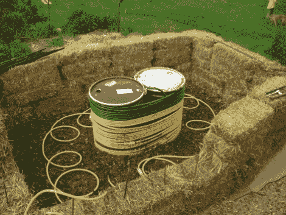

# 制造热水的堆肥

> 原文：<https://hackaday.com/2010/05/23/composting-to-create-hot-water/>

想让大自然给你供应 130-150 度的热水？[Onestraw]向你展示如何通过建造一个加热水的堆肥堆来达到这个目的。发现自己是一辆绿色木屑翻斗车的自豪拥有者，他着手建造自己版本的[吉恩·帕因的热堆肥堆](http://onestraw.wordpress.com/2009/12/23/enter-the-house-of-pain/)。这个想法是生产和储存从堆肥堆中产生的甲烷，但为了做到这一点，温度必须保持相当低。堆肥中的微生物产生大量热量，试图分解这些物质，让水通过系统将保持足够低的温度，让甲烷生产者高兴。这个冷却系统的副作用是热水从另一端流出。[Onestraw]甚至计划利用回收的汽车散热器将热水转化为他家的供暖系统。当然，你不会把它加到你的公寓里，但是[如果你有空间，浪费植物，需要热水](http://hackaday.com/2009/12/14/solar-water-heater/)这是一个很好的方式。

[谢谢乔尔]