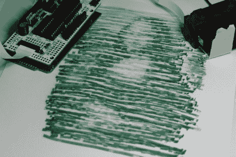

# 计算机辅助画笔

> 原文：<https://hackaday.com/2011/12/20/computer-aided-paint-brush/>

[Nirav]手绘了这幅杰作…在电脑的一点帮助下。他称之为半自动画笔，因为你确实需要用手在画布上移动它，但电脑会决定何时分配墨水。

他使用的是我们在 9 月份看到的一款名为[ink shield](http://hackaday.com/2011/09/12/inkjet-print-head-driver-shield/)的硬件，它得到了 Kickstarter 的支持。这是一个驱动喷墨打印机墨盒的 Arduino 防护罩。诀窍在于如何知道墨盒何时处于打印位置。

该系统使用视觉处理。[Nirav]在墨盒中添加了一个红外 led，并使用相机来推断其位置。他实际上重用了他为投影仪编写的 Python 单应性模块。这种设置是作为数字白板开发的，但也能很好地用于此目的。

他提到，像这样的结果不会在艺术博物馆展出。但它的外观是独一无二的，我们很想用这种技术制作一套古怪的感谢信。