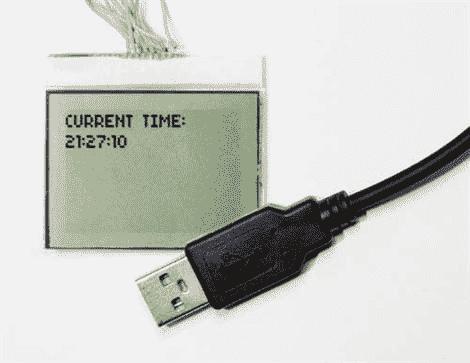

# 使用 AVR 连接诺基亚 3310 液晶屏

> 原文：<https://hackaday.com/2010/07/06/connecting-a-nokia-3310-lcd-using-an-avr/>

在本说明中，[wkter]带我们了解了使用 ATmega8 运行诺基亚 3310 LCD 显示屏的过程。这不是一个初学者项目，因为他假设你已经很好地理解了如何使用这些组件和它们的编程语言。不过，他对信息非常透彻，提供了数据表、引脚排列图和源代码。一旦你记下了这一点，你可以更进一步，制作[康威的《生命的游戏](http://hackaday.com/2009/09/28/capacitive-buttons-control-all-life/)。