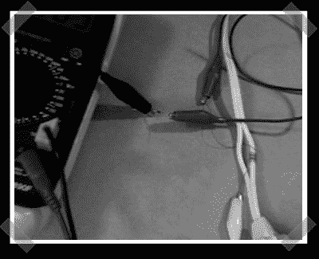

# 无接触电压检测

> 原文：<https://hackaday.com/2008/03/13/contactless-voltage-detection/>

【蒂姆】，那个甜蜜的 [NES pad 控制的西尔维亚](http://www.hackaday.com/2007/09/08/silvia-pic-controlled-pid-looped-espresso-machine/)意式浓缩咖啡机的建造者提出了一个[有趣的想法](http://growdown.blogspot.com/2008/03/non-contact-voltage-presence-measuring.html)用于~~电压~~电流监控——至少对于交流电路来说。简而言之，他通过在绝缘交流电源线的一根电线外面缠绕一些电线，制造了一个迷你变压器。浓缩咖啡机使用 120/220VAC 驱动的螺线管，这就是他如此感兴趣的原因。我喜欢这个想法，因为检测电路只是一根电线。

*   [永久链接](http://growdown.blogspot.com/2008/03/non-contact-voltage-presence-measuring.html)