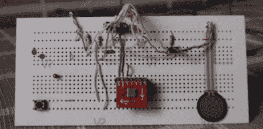

# 用加速度计控制一个令人愤怒的游戏

> 原文：<https://hackaday.com/2011/07/21/controlling-an-infuriating-game-with-an-accelerometer/>

[丹尼尔]刚刚做了一个[运动控制游戏控制器](http://vimeo.com/25952079)来搭配他的[真气游戏](http://www.switch-estudios.com.mx/games/smartball.html)。谢天谢地，【丹尼尔】[贴出了这个游戏的源代码](http://www.switch-estudios.com.mx/games/SmartBall.pde)，所以第一次玩的玩家已经知道关卡选择代码了。

控制器基于 Arduino Uno，看起来像是一个 [Sparkfun 2 轴加速度计](http://www.sparkfun.com/products/844)提供倾斜感测。一个类似来源的半英寸力敏电阻和温度传感器控制着游戏中的“跳垫”。一个小型振动传呼机马达绑在控制器上作为震动包。

这个游戏本身是由[处理](http://processing.org/)构建的，非常难(至少使用 PC 和鼠标)而且相当容易上瘾。我们会不断告诉自己，游戏很难，因为我们没有一个好的控制器。这让我们不用在笔记本电脑上发泄不满，但它确实勾起了我们对 MadCatz 事件的回忆。

查看下面的视频进行演示。

[https://player.vimeo.com/video/25952079](https://player.vimeo.com/video/25952079)