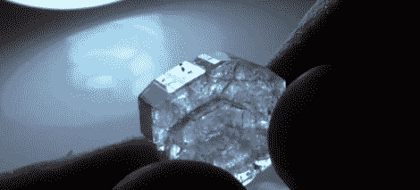

# 在家烹饪压电晶体

> 原文：<https://hackaday.com/2011/03/15/cooking-up-piezo-crystals-at-home/>

[Collin]喜欢压电-为什么不呢？

根据他的说法，它们是世界上你能找到的最接近魔法的东西。在这一点上我们真的不能不同意——压电材料有一种奇怪的魅力。

如今，大多数商用压电器件都是由锆钛酸铅等人造陶瓷材料制成，可用于烤架启动器、燃气热水器等。虽然它们很常见，但在家里合成这些种类的陶瓷材料并不容易。

然而，你可以在你的厨房里制造压电晶体，只需要一些简单的原料。在他的视频中，[Collin]向我们展示了如何制造罗谢尔盐，这是最先发现的具有压电性的已知材料之一。这份食谱需要三种成分，酒石、碳酸钠(苏打灰)和水——就是这样。程序很简单，需要你加热水和酒石的溶液，一旦达到合适的温度，每次加入一点苏打灰。溶液澄清后过滤，然后静置过夜，形成晶体。

看看下面嵌入的视频，看看他的罗谢尔晶体是如何制作的，如果你的孩子对电子产品感兴趣，一定要和他们一起尝试一下。制造轻敲时能发电的晶体比制造冰糖酷多了，相信我们。

[https://www.youtube.com/embed/K3G2QM5a-9U?version=3&rel=1&showsearch=0&showinfo=1&iv_load_policy=1&fs=1&hl=en-US&autohide=2&wmode=transparent](https://www.youtube.com/embed/K3G2QM5a-9U?version=3&rel=1&showsearch=0&showinfo=1&iv_load_policy=1&fs=1&hl=en-US&autohide=2&wmode=transparent)