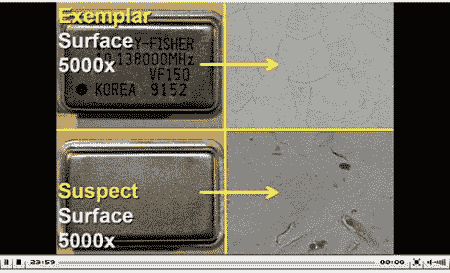

# 军用武器中的假冒电子产品

> 原文：<https://hackaday.com/2011/11/08/counterfeit-electronics-in-military-weapons/>

Boeng 和美国军方发现新 P-8 的一些系统有缺陷。罪魁祸首:[假冒电子](http://defensetech.org/2011/11/08/counterfeit-parts-found-on-new-p-8-posiedons/)。这些是 80-90 年代电子产品的废弃零件，它们被重新贴牌并作为新品卖给政府。许多零部件都与中国的经销商有关联，但中国政府认为没有必要追究此事(根据这篇文章)。

一项国防运作法案的修正案正在酝酿中，该修正案要求来自中国的所有部件在安装前都要经过严格的检查和测试。不管你对军事行动或军费开支的立场如何，也不管你想把它和什么政治方面联系起来，我们都同意设计用来毁坏东西和杀死人的危险东西不应该有有缺陷的电路，对吗？

[途径 [Adafruit](http://www.adafruit.com/blog/2011/11/08/counterfeit-parts-found-on-p-8-posiedons/)