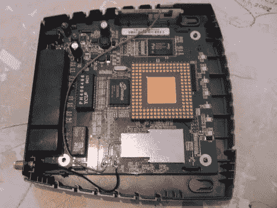

# 作为散热器的 CPU

> 原文：<https://hackaday.com/2010/05/01/cpu-as-a-heat-sink/>

我们已经注意到无线路由器会散发大量热量。[Jernej Kranjec] [想要确保一旦他开始使用 OpenWRT 向他的路由器添加更多负载，他不会烧坏它](http://perceptumvolo.blogspot.com/2010/04/using-old-tech-to-improve-new-tech.html)。他想到的是用一个旧 CPU 作为被动散热器的想法。他在中心涂了一点热浆糊，在角落涂了一些强力胶。你可以看到成品是一个旧的 AMD 芯片坚持“死虫”风格的股票处理器。我们敢打赌，与铝或铜散热器相比，它的效率不是很高，但它通常无助于降低额外的温度。