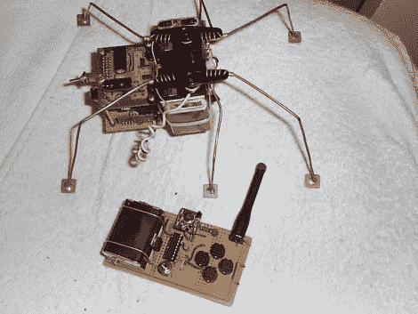

# 用遥控控制器制作六足机器人

> 原文：<https://hackaday.com/2011/07/11/crafting-a-hexapod-with-an-rc-controller/>

这是一个奇妙的项目，让[用遥控控制器](http://bfreebandingtalktheplanet.runboard.com/t2396)在房间里驾驶六足机器人。[YT2095]在升级过程中更换了机器人手臂上的伺服电机后，制造了这个机器人。他留下的三个小气鬼只是在乞求一个新项目，他说他在大约一个小时内就完成了第一个概念验证模块。当然，从那以后，你在上面看到的已经有了很大的改进。

三台电机用环氧树脂粘合在一起，中间的一台垂直安装在电机的两侧。这两个负责每侧的前腿和后腿，第三个电机驱动中间的两条腿。这是一个我们已经熟悉的设计，我们见过更小的 Pololu 版本。你可能想[看看那个](http://hackaday.com/2010/01/18/the-polulu-3-servo-hexapod/)，因为有一些慢动作视频显示这是如何工作的。

[YT2095]增加了包括射频接收器的控制电路。这让他可以使用一个带有四个瞬时按钮开关的发射器来驾驶这个小机器人。我们喜欢用覆铜做脚垫的想法。