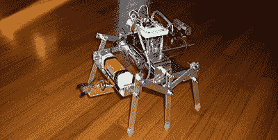

# 曲柄臂式六足机器人

> 原文：<https://hackaday.com/2011/02/28/crank-arm-style-hexapod/>

诺莱博迪最新的机器人是艾尔。即 se，或[铝，红外扫描实体](http://nolebotic.blogspot.com/2011/02/robots-alise.html)。不要让这个名字欺骗了你，这是一个非常简单的经典六足步行平台，使用曲柄臂和树叶制成的腿。

机器人的身体由铝制成，很容易在家里使用，重量轻，坚固。用螺栓固定在车身上的是一对结实的齿轮头马达，一个 9.6 伏可充电电池组，以及一个基本的 stamp 2 和它自己的 9 伏电源，以及一个 [Solarbotics 1198 CMD 驱动板](http://www.solarbotics.com/products/k_cmd/)。

障碍物现在用基本的红外线探测器和发射器来处理，但是在演示中避开一些图书馆的书似乎很有效。结合干净的机械和相当好的步幅，这个东西可以很快起来移动。